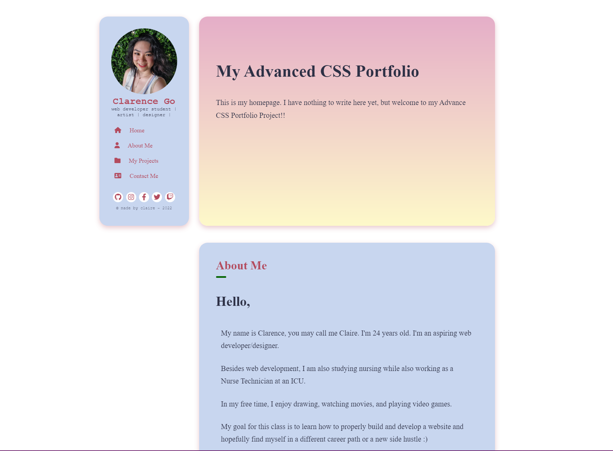

# Claire's Pastel Porfolio

## Description

This project was to build a web application portfolio template using HTML and advanced CSS elements.

I built this project to further practice my skill in using HTML and CSS.

I learned how to properly organize a website and view it in sections.

## Installation

Deploy the code as is

## Usage

- To edit any texts, open index.html file and change any texts you would like to change.

## Credits

Me, Myself, and I

## Features

- fixed floating sidebar with navigation menu
- socials list
